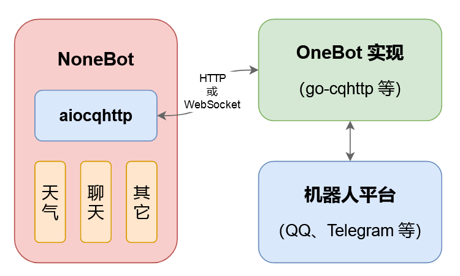

# NoneBot
NoneBot 是一个 Python 的异步 QQ 机器人框架，它会对 QQ 机器人收到的消息进行解析和处理，并以插件化的形式，分发给消息所对应的命令处理器和自然语言处理器，来完成具体的功能。

官方文档地址:https://docs.nonebot.dev/guide/

其运行逻辑可以见下图(来自官方文档)
<h1 id = '1'></h3>


大致上可以理解为,为了写一套执行逻辑,可以在多个平台使用,因此做了两层抽象,OneBot负责与具体的(不同的)机器人平台进行信息交互,转化为统一的消息格式交给NoneBot进行基础逻辑的执行,之后NoneNot返回的结果交给OneBot实现不同平台消息的转化.以此实现不同平台的代码复用.

## 安装
首先NoneBot基于python,并且要求python版本>=3.7,因此确保python版本的情况下可以直接使用pip命令行进行安装
```cmd
pip install nonebot
```
如果这种方法不行可以考虑直接从github中clone,源码安装,官方文档中有具体操作步骤详情请见:https://docs.nonebot.dev/guide/installation.html

## 最小可行模型
这里先放上官方文档地址:
https://docs.nonebot.dev/guide/getting-started.html

如果不想看,或者不太理解官方文档的可以看下面个人的一些理解,首先还是先展示一下最小可行模型
```python
import nonebot

if __name__ == '__main__':
    nonebot.init()
    nonebot.load_builtin_plugins()
    nonebot.run(host='127.0.0.1', port=8080)

```

这里nonebot.init()负责对nonebot运行时部分动态内容对象初始化以及加载,具体实现可以参考[这篇文章](https://www.cnblogs.com/kirito-c/p/10458068.html)(如果后面有时间打算回来再看看,挖个坑)
nonebot.load_builtin_plugins加载部分nonebot插件,保证基础功能的使用
nonebot.run就是正式运行nonebot,这里需要设置ip地址以及端口号,如果学过计算机网络相关知识应该不难理解
> 如果没学过可以象征的理解为:将你的电脑视为一个商店,地址使用127.0.0.1进行标识,同时你开了第8080个窗口专门用于处理Bot相关服务,那么别人就可以使用127.0.0.1:8080来向你发送请求,或者接受消息

这样之后我们就可以使用命令行运行该脚本:
```
python bot.py
```
如果没有大问题的话应该能看到几行输出,但是此时NoneBot还不能正常工作,原因在于我们可以看到上述[图1](#1),我们目前已经完成了Nonebot部分的最小可行模型,但是我们还缺少OneBot来负责中间通信,因此下面我们将搭建OneBot的环境.

## go-cqhttp配置
从[github项目](https://github.com/Mrs4s/go-cqhttp/releases/)中下载对应的release版本go-cqhttp,解压后使用命令行运行对应的可执行文件,第一次运行时会出现下面的选项:

这里选择方式三,之后会生成配置文件config.yml,然后我们编辑配置文件(如设置关联bot的QQ号,密码),Nonebot服务器IP地址端口号
配置账号:

配置服务器地址(如:ws://127.0.0.1:8080):
